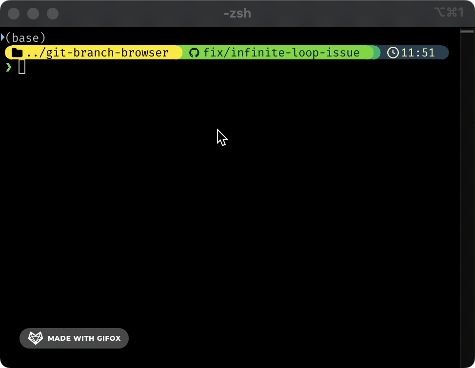

# Git Branch Browser

Interactive Git branch switcher with fuzzy search and arrow key navigation.

<p align="center">
  
</p>

## Features

- 🔍 **Interactive Selection**: Browse and select branches with arrow keys
- 🧠 **Smart History**: Shows your most recently used branches
- ⚡ **Fast Switching**: Quickly jump between branches without typing full names
- 🔄 **Fuzzy Search**: Type to filter branches as you search
- 🎮 **Keyboard Navigation**: Use arrow keys, Enter to select, Esc to cancel

## Installation

```bash
# Clone the repository
git clone https://github.com/threedivers/git-branch-browser.git
cd git-branch-browser

# Run the installer
./install.sh
```

## Dependencies

- [fzf](https://github.com/junegunn/fzf) - Command-line fuzzy finder
- Git (obviously)

The installer will check if fzf is installed and guide you through installing it if needed.

## Usage

```bash
# Show last 5 branches (default)
git-branch-browser

# Show last 10 branches
git-branch-browser 10

# Show help
git-branch-browser --help
```

### Using the Alias

During installation, you'll be asked if you want to add a `gbb` alias to your shell configuration. If you choose yes, you can simply use:

```bash
gbb
```

## Example

When you run the tool, you'll see an interactive menu like this:

```
Select a branch to switch to:
> main
  feature/new-dashboard
  fix/login-bug
  docs/readme-update
  refactor/api-client

Branch > 
```

- Use ↑/↓ arrow keys to navigate
- Type to filter the list
- Press Enter to select and switch to that branch
- Press Esc or Ctrl+C to cancel

## Tips

### Integration with Git Aliases

Add this to your `.gitconfig`:

```
[alias]
    bb = "!git-branch-browser"
```

Then use:

```bash
git bb
```
